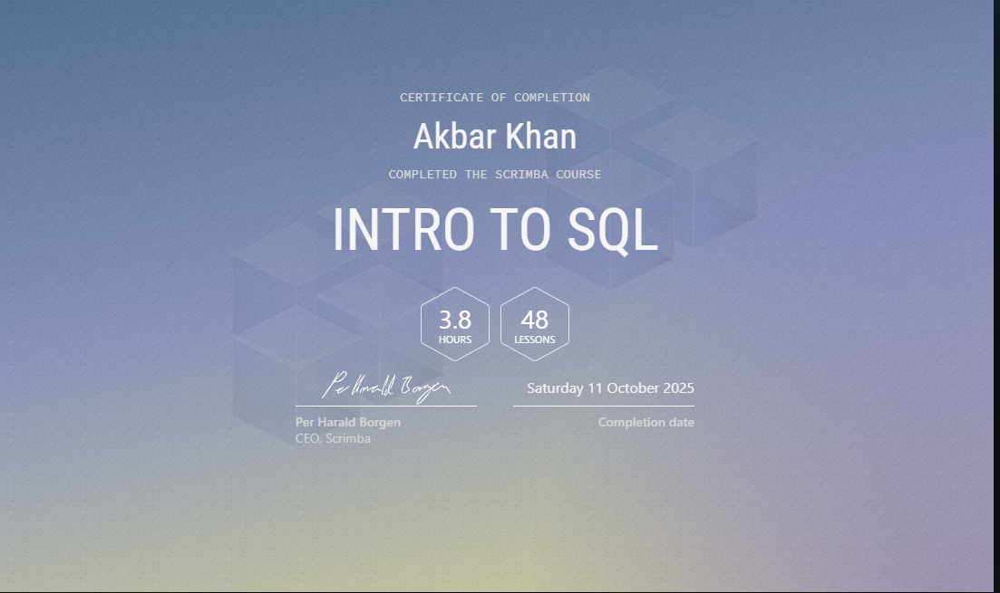

# 🗄️ Database Journey

Welcome to my Database Journey — a complete hands-on exploration of SQL and database fundamentals.
I recently completed the “Intro to SQL” course by Scrimba, gaining practical experience in writing, analyzing, and optimizing SQL queries.

---

## 🎯 Goal
The purpose of this project is to **build a solid foundation in database concepts** through consistent, practical learning.  
Each commit represents a focused step in my learning process — from writing simple `SELECT` queries to mastering clauses like `GROUP BY`, `HAVING`, and `JOIN`.

---

## 🧠 What I Learned
- Core SQL commands: `SELECT`, `WHERE`, `ORDER BY`, `GROUP BY`, `HAVING`, `LIMIT`
- Filtering, sorting, and aggregating data with real query examples  
- Understanding how relational databases organize and store information  
- Writing clean, well-commented SQL for readability and reusability  
- Using CASE, JOIN, and aggregate functions to solve real-world problems

---

## 🪄 Why This Matters
This project shows my **genuine learning process** — not copied content.  
Every commit reflects the actual steps I took while studying and practicing databases.  
It demonstrates how I approach learning by building, experimenting, and improving with each iteration.

---

## 🧩 Tech Stack
- **SQL** — Core query language for data manipulation  
- **PostgreSQL / MySQL** (conceptual focus)  
- **VS Code** for writing and testing queries  

## 🎓 Certification
Successfully completed the **Intro to SQL** course from **Scrimba**  
📜 Duration: 3.8 hours | 48 lessons  
🗓️ Completed on: 11 October 2025  

---

## 🚀 Next Steps
Now that I’ve built a strong foundation in SQL, I’m moving forward to:
- Integrate SQL with **Node.js (Express)** for backend projects  
- Explore **NoSQL databases like MongoDB**  
- Work on **data-driven full-stack applications**

---

---

## 📘 About This Project
I created this repository as part of my continuous journey to become a stronger full-stack engineer with a deeper understanding of data systems.  
It’s meant to be a transparent record of growth — not perfection — and a space for exploring new database concepts step by step.

---

_If you’re reading this as a recruiter or collaborator — this repository is 100% my own work, built gradually and intentionally to strengthen my understanding of databases._
